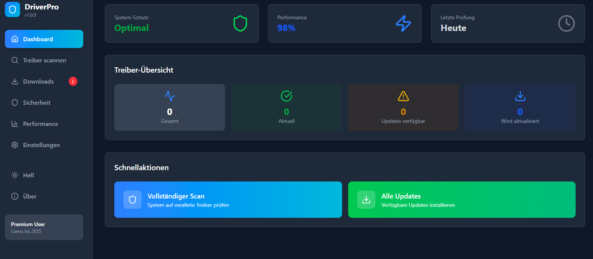
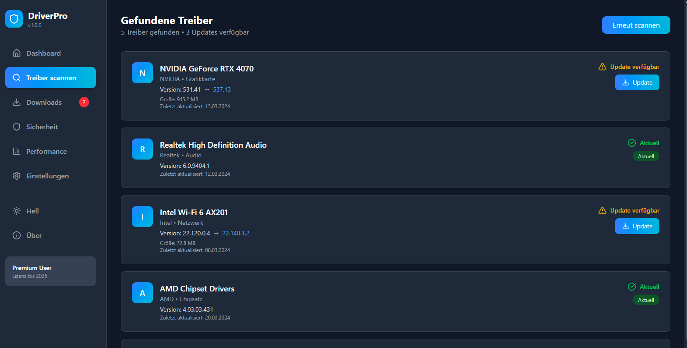

# 🚀 DriverPro – Open Source Driver Updater

  

  
  
  
  

---

## 📖 Überblick
**DriverPro** ist ein moderner Open-Source **Driver Updater** für Windows.  
Die App scannt dein System, zeigt verfügbare Treiber-Updates an und erlaubt das gezielte oder automatische Aktualisieren.  
Das Projekt wurde als WPF-Client in **C# / .NET Framework 4.7.2** entwickelt und bietet eine **moderne Dark/Light UI**.

---

## ✨ Features
- 🔍 **System Scan** → Erkennung installierter Treiber  
- 📊 **Scan-Progress** → animierter Fortschritt (0% → 20% → … → 100%)  
- 📑 **Treiberliste** → Übersicht über alle installierten Treiber  
- ⚡ **Update Check** → Markierung, welche Treiber veraltet sind  
- 🎨 **Modernes UI** → Dark-/Light-Theme, Fluent Design  
- 🖱️ **Update Actions** → Einzeln oder alle Treiber aktualisieren  
- 🛡️ **Sicherheit** → Scanner zeigt auch potenziell unsichere Treiber  

---

## 📸 Screenshots

| Dashboard | Scan | Ergebnisse |
|-----------|------|------------|
|  |  |  |

---
